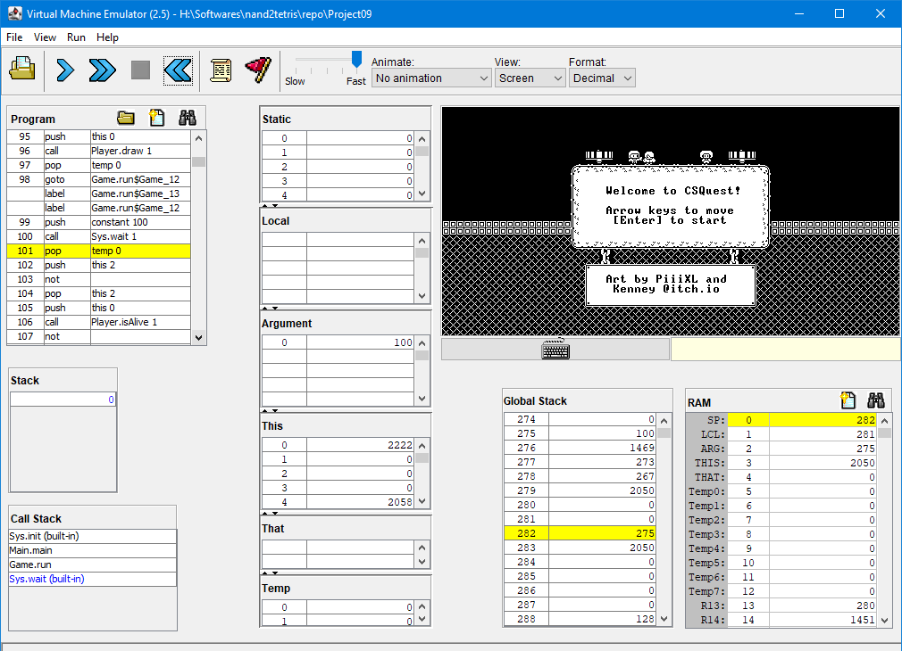

# CSQuest

CSQuest is a small puzzle/adventure game written in Jack. The game can be run on the VM emulator provided [here](https://drive.google.com/file/d/1xZzcMIUETv3u3sdpM_oTJSTetpVee3KZ/view).

> *The artwork assets for the game are taken from the free assets put on itch.io by [PiiiXL](https://piiixl.itch.io/) and [Kenney](https://kenney.itch.io/), and then converted to bitmaps to work with the Hack CPU architecture.*




## How to Run

Download the Nand2Tetris Software Suite from this [link](https://drive.google.com/file/d/1xZzcMIUETv3u3sdpM_oTJSTetpVee3KZ/view).

> [!NOTE]
> *While Nand2Tetris now uses their web-based IDE for emulation, since this project was written for the legacy Java software package linked above, it is recommended you run it there. The tick rate for the new web-based IDE's CPU is too fast which makes the game's tile animations and movement too jarring. Plus, there are numerous graphics bugs when running the game on it.*

For troubleshooting and FAQ regarding the software suite, refer to the document [here](https://drive.google.com/file/d/1IkIR8Pwq3PY49QgXpUJOkUUVht-TKIET/view). If you're using MacOS, refer to [this guide](https://drive.google.com/file/d/1QDYIvriWBS_ARntfmZ5E856OEPpE4j1F/view) for the installation setup.

You need to launch the `VMEmulator` (the batch file) from the `tools` folder (the `projects` folder can be removed). Once the emulator is up and runnning, follow these steps in order:

1. load the VM files by clicking the `Load Program` button or through the File>Load Porgram dropdown menu. In the dialogue box, navigate to this repo's `CSQuest` folder and click Load Program. You don't need to select a particular file, the emulator will load all the VM files from the directory on its own.

    There will be a prompt to load the built-in implementations of the OS functions, click Yes on it. Once all the files are loaded, you can see the instructions populated inside the Program tab.

2. Locate the VM speed slider on top-middle portion and drag the slider all the way to the right toward "Fast".

3. Next to the slider are three dropdowns. In the `View` section, make sure `Screen` is selected. This makes sure that the Hack CPU's screen is displayed in the window below.

4. In the `Animate` section, select the `No Animation` option. This stops the emulator from showing how the program flow is updated and lets it run at full speed.

5. Finally, click the Run button `>>` on the top left to run the game. At this point the screen window inside the emulator should show the welcome screen (the image above).

Here's an image showing what the steps are:


If for some reason, nothing happens (because you clicked the stepper by mistake or ran the program without selecting the "No Animation" option), click the Reset Button `<<` to reset the program counter, make sure all settings are configured as specified, and click Run `>>` again.

## Gameplay

The player can use the `W, A, S, D` keys to move the main character around. When prompted, they can interact with certain game objects by pressing the `E` key.

The game has 5 levels, with 3 of them containing puzzles and 1 combat encounter. In the first level, the player starts off in a village where the generator siphoning power from the dungeon has been shut down due to flooding. The player is asked to assist the engineer in repairing it.


Talking to the engineer opens the gate to the second level. Here, they must assist the engineer by fixing the misaligned pipes to drain out the flood water and retrieve the power cores. Once the player returns the core to their respective slots, the water pumps start working and the player can access the next level.


The third level takes the player to the generator's main reactor room. Due to the flooding, the system modules have been scrambled. The player must make sure to restart the reactor by aligning all the modules (the patterns displayed in the center) with the one displayed on the console in three separate phases. Each pattern slot on the grid corresponds to a number on the keyboard's numpad. Pressing a key will cycle all the patterns in that row and column to the next cycle. The player must figure out the right combination of keys to press in order to turn all the patterns to the one displayed on the console to the right.


Once the player finishes all three puzzle phases, the reactor finally boots up and the player is taken back to the beginning of the game. This time, the generator is fully operational and running. The engineer now tells the player to go into the dungeon and disable the golem (who has now woken up due to a security measure in the dungeon). The player must head inside and reboot the control device to disable the golem so that power can be redirected to the village.


Before the player can get to the golem, they must make their way past the dungeon's security systems. If the player steps on the spikes or gets hit by a fireball, they lose one of their lives.


Once the player reaches the end of the corridor, they can enter the door and face their final opponent: the security golem. The player needs to dodge all the fireballs and interact with the console behind the boss to deactivate it.


Once the player does that, game is over.


At this point, the user can restart the emulator and play the game again if they want.

# Design and Documentation

The Jack source files for the game can be found inside the [src](./src/) folder. The compiled VM files are what the emulator uses to run the game. Before I start talking about the game's design, let us begin with some of the hurdles we had to circumvent in order to get this to work.

## Platform Challenges

At the heart of the Hack Computer lies a very simple CPU. We only have addition, subtraction, and the basic `&`, `|`, and `!` logic operations. There's no support for multiplication, division, bit shifts, etc. This isn't a huge problem for us because you can do a lot with just that. It is just going to take more instructions to do what we want. The main problem is the extremely limited amount of memory on our CPU.

Since the Hack CPU is a 16-bit machine and we dedicate 1 bit to the op-code, this leaves us with only 15-bits of addressable memory. This gives us $2^{15}$ or $32,768$ possible memory locations to work with. Now, we also have to account for the memory mapped I/O devices, namely, the screen and the keyboard. The screen occupies $8,192$ words in memory, while the keyboard takes up a single word. Since the Keyboard and the Screen are separate memory modules in the architecture, in order to avoid any extra hassle with addressing these modules, the Hack CPU dedicates an extra bit to address these two modules.

This leaves us with only 14 bits for addressable memory space giving us a RAM with $2^{14}$ or $16,384$ words of memory to work with.


So we have a very small RAM. We can still manage. We'll just have to re-allocate or recycle as much as we can and be frugal with our allocations. This means writing a little more code for this orchestration.

But all this extra code also has an upper limit. Because we have no support for storage devices, we can't just shuffle code in and out of our instruction memory. In fact, if you remember the assembly specifications, our A-register is used to select both the data memory and the instruction memory at the same time. So we have a hard limit on $32,768$ CPU instructions for our game. Mind you, the Jack OS library also shares this instruction space.

Our one respite in this situation is that by running the code on the VM Emulator (and not the CPU emulator), we can force the emulator to load the built-in version of the Jack library, which, according to my interpretation, should trap into the Java side of the emulator and not the Hack side.

One solution would be to prune away all the OS functions we do not need by supplying our own implementation of the Jack OS API. Since I could not get a concrete answer for whether the built-in version of the OS API actually takes up instruction space, I decided to not to do this.

## Rendering Graphics

Our screen is 512 pixels wide and 256 pixels tall where each individual pixel is mapped onto the RAM. With each RAM word being 16 bits wide, this gives us 8,192 words in a 32x256 grid arrangement. The screen section in the RAM starts off at location 0x4000 (or 16,384).

While the Jack OS API provides us with functions to draw pixels on the screen on a given (x, y) position (along with drawing lines and circles), it is simply too inefficient for us to go through the expensive overhead of making a function call to update a single pixel. Instead, we'll take a page from the OS's book and use the array indexing notation to write words directly into the RAM's screen section to update pixels on the screen:

```JavaScript
var Array screen;
let screen = 16384;
let screen[0] = -1;
```
> *This works thanks to how the compiler deals with the array notation as arrays in Jack are just any other object and not a primitive construct.*

The game implements a Tile Renderer which divides this screen into a 64 by 32 unit grid composed of 8-pixel wide square blocks. The basic unit of this tile system, a tile, is 16 pixels wide. The renderer can "stamp" this tile on any particular place on the grid to draw it on the screen. This means that drawing each of the tile's rows will always correspond to editing either a full word or two half-words in memory.