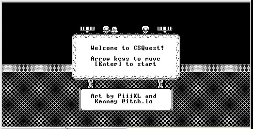
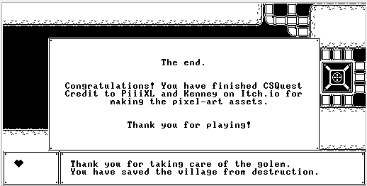

# CSQuest

CSQuest is a small puzzle/adventure game written in Jack. The game can be run on the VM emulator provided [here](https://drive.google.com/file/d/1xZzcMIUETv3u3sdpM_oTJSTetpVee3KZ/view).

> *The artwork assets for the game are taken from the free assets put on itch.io by [PiiiXL](https://piiixl.itch.io/) and [Kenney](https://kenney.itch.io/), and then converted to bitmaps to work with the Hack CPU architecture.*




## How to Run

Download the Nand2Tetris Software Suite from this [link](https://drive.google.com/file/d/1xZzcMIUETv3u3sdpM_oTJSTetpVee3KZ/view).

> [!NOTE]
> *While Nand2Tetris now uses their web-based IDE for emulation, since this project was written for the legacy Java software package linked above, it is recommended you run it there. The tick rate for the new web-based IDE's CPU is too fast which makes the game's tile animations and movement too jarring. Plus, there are numerous graphics bugs when running the game on it.*

For troubleshooting and FAQ regarding the software suite, refer to the document [here](https://drive.google.com/file/d/1IkIR8Pwq3PY49QgXpUJOkUUVht-TKIET/view). If you're using MacOS, refer to [this guide](https://drive.google.com/file/d/1QDYIvriWBS_ARntfmZ5E856OEPpE4j1F/view) for the installation setup.

You need to launch the `VMEmulator` (the batch file) from the `tools` folder (the `projects` folder can be removed). Once the emulator is up and runnning, follow these steps in order:

1. load the VM files by clicking the `Load Program` button or through the File>Load Porgram dropdown menu. In the dialogue box, navigate to this repo's `CSQuest` folder and click Load Program. You don't need to select a particular file, the emulator will load all the VM files from the directory on its own.

    There will be a prompt to load the built-in implementations of the OS functions, click Yes on it. Once all the files are loaded, you should see the instructions populated inside the Program tab.

2. Locate the VM speed slider on the top-middle portion and drag the slider all the way to the right toward "Fast".

3. Next to the slider are three dropdowns. In the `View` section, make sure `Screen` is selected. This makes sure that the Hack CPU's screen is displayed in the window below.

4. In the `Animate` section, select the `No Animation` option. This stops the emulator from showing how the program flow is updated and lets it run at full speed.

5. Finally, click the Run button `>>` on the top left to run the game. At this point the screen window inside the emulator should show the welcome screen (the image above).

Here's an image showing what the steps are:


If for some reason, nothing happens (because you clicked the stepper by mistake or ran the program without selecting the "No Animation" option), click the Reset Button `<<` to reset the program counter, make sure all settings are configured as specified, and click Run `>>` again.

The images shown here are what the expected speed of the game is supposed to look like (I cannot control it due to the reasons described later). If your game is too fast in comparison, you can try tweaking with the speed slider in the VM panel. If it is too slow, you'll have to edit the VM code as follows:

- open the `Game.vm` file in a text-editor.
- goto line 291 and edit the `100` in the `push constant 100` to a smaller value
- reload the game in the emulator and run again

## Gameplay

The player can use the arrow keys to move the main character around. When prompted, they can interact with certain game objects by pressing the `E` key.

The game has 5 levels, with 3 of them containing puzzles and 1 combat encounter. In the first level, the player starts off in a village where the generator siphoning power from the dungeon has been shut down due to flooding. The player is asked to assist the engineer in repairing it.


Talking to the engineer opens the gate to the second level. Here, they must assist the engineer by fixing the misaligned pipes to drain out the flood water and retrieve the power cores. Once the player returns the core to their respective slots, the water pumps start working and the player can access the next level.


The third level takes the player to the generator's main reactor room. Due to the flooding, the system modules have been scrambled. The player must make sure to restart the reactor by aligning all the modules (the patterns displayed in the center) with the one displayed on the console in three separate phases. Each pattern slot on the grid corresponds to a number on the keyboard's numpad. Pressing a key will cycle all the patterns in that row and column to the next cycle. The player must figure out the right combination of keys to press in order to turn all the patterns to the one displayed on the console to the right.


Once the player finishes all three puzzle phases, the reactor finally boots up and the player is taken back to the beginning of the game. This time, the generator is fully operational and running. The engineer now tells the player to go into the dungeon and disable the golem (who has now woken up due to a security measure in the dungeon). The player must head inside and reboot the control device to disable the golem so that power can be redirected to the village.


Before the player can get to the golem, they must make their way past the dungeon's security systems. If the player steps on the spikes or gets hit by a fireball, they lose one of their lives.


Once the player reaches the end of the corridor, they can enter the door and face their final opponent: the security golem. The player needs to dodge all the fireballs and interact with the console behind the boss to deactivate it.


Once the player does that, game is over.



At this point, the user can restart the emulator and play the game again if they want.

# Design and Documentation

The Jack source files for the game can be found inside the [src](./src/) folder. The compiled VM files are what the emulator uses to run the game. Before I start talking about the game's design, let us begin with some of the hurdles we had to circumvent in order to get this to work.

## Platform Challenges

At the heart of the Hack Computer lies a very simple CPU. We only have addition, subtraction, and the basic `&`, `|`, and `!` logic operations. There's no support for multiplication, division, bit shifts, etc. This isn't a huge problem for us because you can do a lot with just that. It is just going to take more instructions to do what we want. The main problem is the extremely limited amount of memory on our CPU.

Since the Hack CPU is a 16-bit machine and we dedicate 1 bit to the op-code, this leaves us with only 15-bits of addressable memory. This gives us $2^{15}$ or $32,768$ possible memory locations to work with. Now, we also have to account for the memory mapped I/O devices, namely, the screen and the keyboard. The screen occupies $8,192$ words in memory, while the keyboard takes up a single word. Since the Keyboard and the Screen are separate memory modules in the architecture, in order to avoid any extra hassle with addressing these modules, the Hack CPU dedicates an extra bit in the instruction for addressing.


This leaves us with only 14 bits for addressable memory space giving us a RAM with $2^{14}$ or $16,384$ words to work with.

So we have a very small RAM. We can still manage. We'll just have to re-allocate or recycle as much as we can and be frugal with our allocations. This means writing a little more code for this orchestration.

But all this extra code also has an upper limit. Because we have no support for storage devices, we can't just shuffle code in and out of our instruction memory. In fact, if you refer to the assembly specifications, our A-register is used to select both the data memory and the instruction memory at the same time. So we have a hard limit on $32,768$ CPU instructions for our game. Mind you, the Jack OS library also has to reside in this instruction space.

Our one respite in this situation is that by running the code on the VM Emulator (and not the CPU emulator), we can force the emulator to load the built-in version of the Jack library, which, according to my interpretation, should trap into the Java side of the emulator and not the Hack side.

One solution would be to prune away all the OS functions we do not need by supplying our own implementation of the Jack OS API. Since I could not get a concrete answer for whether the built-in version of the OS API actually takes up instruction space, I decided to not to do this.

## Rendering Graphics

Our screen is 512 pixels wide and 256 pixels tall where each individual pixel is mapped onto the RAM. With each RAM word being 16 bits wide, this gives us a 32x256 grid arrangement of words representing all the pixels in memory. If a bit is set to 1, the corresponding pixel on the screen turns black (it turns white for 0). The screen section in the RAM starts off at location 0x4000 (or 16,384).

While the Jack OS API provides us with functions to draw pixels on the screen on a given (x, y) position (along with drawing lines and circles), it is simply too inefficient for us to go through the expensive overhead of making a function call to update a single pixel. Instead, we'll take a page from the OS's book and use the array indexing notation to write words directly into the RAM's screen section to update pixels on the screen:

```JavaScript
/* This sets the first 16 pixels on the topmost row of the screen to black */
var Array screen;
let screen = 16384;
let screen[0] = -1;     // Jack integers are in 2's complement notation
```
> *This works thanks to how the compiler deals with the array notation as arrays in Jack are just any other object and not a primitive construct.*

The game implements a Tile Renderer which divides this screen into a 64 by 32 unit grid composed of 8-pixel wide square blocks. The basic unit of this tile system, a tile, is 16 pixels wide. The renderer can "stamp" a tile on any particular place on the grid to draw it on the screen. This means that drawing each of the tile's rows will always correspond to editing either a full word or two half-words in memory. All the drawing in the game is done via this Tile Renderer (except for the player character).

Each major component in the game has their own tile stamp. Whenever it has to draw itself on the screen, it loads the particular tile data into its stamp and asks the renderer to print it onto the given coordinate on the grid.

As for the tiles themselves, every tile in the game is stored as a bitmap. Since each tile is a 16 pixel wide square block, we can store a single tile's bitmap as 16 integers (or 16 words in memory). While I've used the word "store" here, since there is no file I/O, the only way to input these bitmaps into the program is to write them in the code. This means that each tile in the game also competes for the very limited instruction space in our program. While the game's engine is setup so that adding more levels won't be a problem, we simply do not have enough instruction space to add them.

## Layout and Movement

The game divides the screen into two parts: the playable area and the dialogue UI area. The dialogue UI sits at the bottom of the screen, taking up the last 48 rows of pixels. The rest of the upper side of the screen is the playable area.

The game uses the tile renderer's grid as a movement space for all the object movement as well. All objects in the game move 1 unit at a time (i.e., 8 pixels) on this grid. To prevent the player from running over the entire level, erasing every block they pass over, the game implements a *spatial hash map* for the playable area as follows:


The map allocates each bit for a unit on the movement grid. This means 4 words in memory for each row. For 32 rows on screen, the hash map fits into 128 words in the RAM. Accounting for the UI area, we can shave off additional 24 words for the bottom 6 rows giving us a final size of 104 words.

The game's Level Manager manages this hash map, zeroing it out before sending it to the current level upon initialization. Whenever a level prints out its tilemap on the screen, it simultaneously updates the corresponding set of bits in the hash map.

Because our player takes up 2 units on the grid, it occupies a 2x2 area on this hash map. Furthermore, as the player's position is tied to the top-left corner of this block, we need to account for the rest of their body bleeding into a tile. Hence, we have to additionally update 5 more bits in our map for every tile placed on the screen.

Whenever the player moves, the game polls the hash map to see if the player can be moved to the desired area. If even a single bit in the area is set to 1, the player cannot move there, and the movement request is rejected.

## Collision Detection

Since we only have a 2D plane to worry about, not much work needs to be done on collision detection. While the spatial hash map takes care of all the static objects -- and because we have a small number of moving objects in the game -- we can get away with the standard method of collision detection by simply checking the bounds of every currently moving object in the object list against the player's.


As the number of moving objects per level is quite small (<10), we do not need to implement any special data structures (like a priority queue) to resolve collisions effectively.


## Animation

While Jack is a language with objects, it lacks the defining OOP feature of class inheritance. Otherwise, we could have declared a parent Item class and inherited it across a range of items in our game. Each item could've had its own implementaion of drawing itself, moving itself, or interacting with the player, etc. But since Jack doesn't have inheritance, we'll just bake all the code for every item into the `Item` class. We assign an `id` field on initialization to distinguish items from each other across methods.

Our game engine keeps a reference to a list of items. It passes it around to the Level Manager which then passes it further to each individual Level. Each Level, upon initialization, fills this list with the references to all the animated items it creates. On every tick, the engine calls the `draw()` function for each item, which is configured to automatically load the next frame's tile into the tile stamp, erase the current tile on the screen, and print the new tile.

Each item's frame data is stored inside the Tile class. The frame rate for the animation is managed on two fronts. The Item class has `frames` and `currentFrame` variables which describe the number of frames in the animation and the current animation frame. An item could only have two or three frames in a complete cycle, but cycling them on every tick would make the animation appear too fast. In order to have the correct pacing, we define offets in the stored frame data inside the Tiles class. When the value of `frame` crosses an offset value, we change to the next frame in the cycle. We tweak the value of this offset along with the `frames` variable to achieve a desired frame rate cycle with respect to the game's tick rate.

## Events

The responsibilty of handing events in the game falls on the game engine as well as each individual level. One each tick, the game engine processes collision-related events and positional/key-press events separately. The game engine asks the Level Manager to process any events related to the player's current position and the currently pressed key on the keyboard. The Level Manager forwards the request to the currently active level and the level decides whether a key event can be triggered with the provided data and the current state of the level.

In case of collision-related events, we process each one based on the type of the item. If it is an item that damages or heals the player, then it is handled right away. But if the item is a "key item", then the event is passed to the Level Manager. The idea was that different key items might interact with the player and the level in different ways. For example, picking up a power core in one level might unlock a locked gate while in another level, the player might require another item along with the power core to activate the gate (and they could pick them up in any order).

Unfortunately, because of the instruction limitation, this collision-related event system was never fully utilized. Most of the levels simply do not have an implementation for handling the key collisions, and majority of the events in the game are of the positional/key-press type.

## Dialogues and UI

The game's UI is divided into two components: Dialoge UI and Player Status UI. The player status UI, located on the left side, keeps track of the player's current health. It shows each health point as a heart. The Dialogue UI on the right displays any dialogue text during the game. It can display 2 lines of text, each one being able to hold 40 characters.

Just like printing everything else, printing text also involves updating values in the RAM's screen portion. Thankfully, the Jack OS's Output class does exactly that for us when it comes to printing text on the screen, so we don't have to worry about managing bitmaps and printing for the character set.

Updating the player status as well as displaying any dialouges is the responsibility of the Dialogue Manager class. While processing events, the individual level can use the Dialogue Manager's interface to display dialogues.

## Game Engine

We've already talked plenty about the game engine's responsibilities and role across all the aspects discussed so far, so I'm going to briefly list all the things the engine performs per tick.

- Check and store the currently pressed key on the keyboard
- If an arrow key was pressed, move the player in the proper direction
- On every other tick, move any items (in the current level) which have pathing specified for them
- Animate items in the current level by advancing them to the next animation frame
- Animate any static objects in the current level (like fans and gears)
- Detect any player-item collisions and process them accordingly
- Process positional/key-press related events in the current level
- Check if the current level is cleared. If it is, load the next level
- Flip the slow bit (helps move items every other tick)
- Detect if the player is alive
- Detect if the player has finished the game

Between each tick, the engine makes a `Sys.wait(100)` call which is supposed to set the tick rate to specific period. But becuase the way Jack OS's `Sys.wait()` is implemented, the waiting period is inconsistent across different machines.

Once the player is dead or the game is finished, the engine gets out of the tick loop and displays a proper end game screen to the player before halting execution.