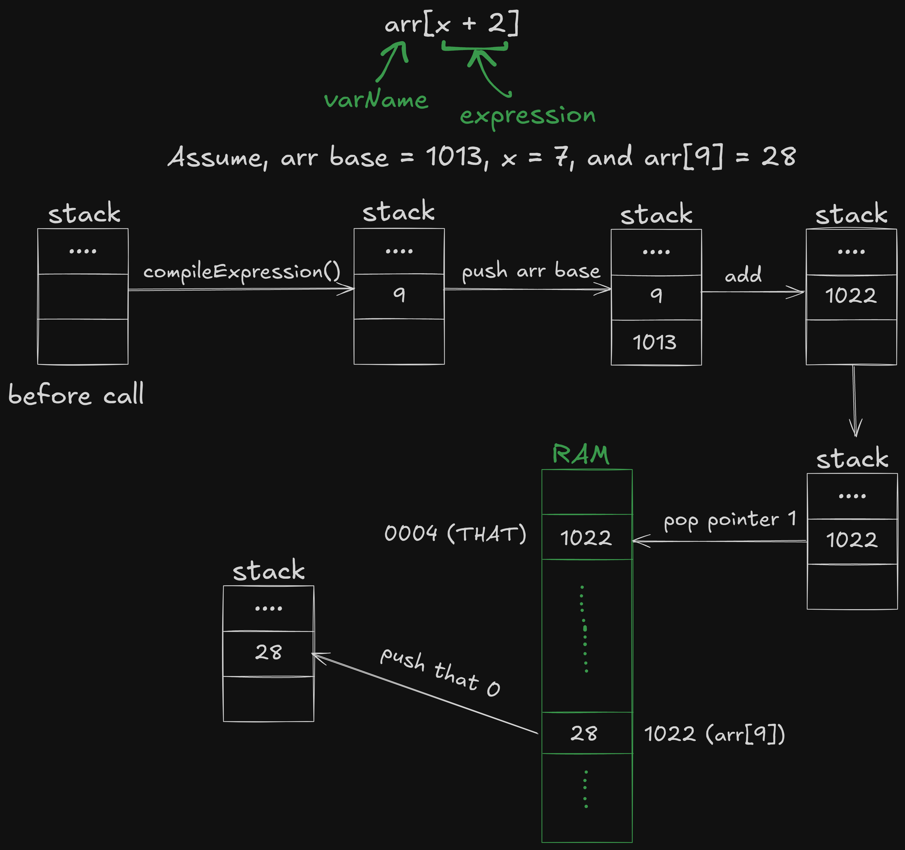

# Jack Compiler

A program that compiles Jack files to VM code.

## Usage

*requires Java 17 and above*

compile the Java files first,

```shell
prompt> javac JackCompiler.java
```

then run,

```shell
prompt> java JackCompiler FILE_NAME.jack
```

The program will output a Hack VM file (.hack) in the same folder as the input file. 

You can also input a directory instead of a file and the program will process all valid Jack files in the directory (the program doesn't recursively look for files in sub-directories though).

## Documentation

Jack is a simple, Java-like, object-based programming language. It is designed to lend itself nicely to common compilation techniques. It is weakly typed and features only 3 primitive data types, but provides access to user-defined data types via objects. Let's start with an example Jack program, and then we'll list the language grammar and specfications.

```JavaScript
/** Inputs a sequence of integers, and computes their average. */
class Main {
    function void main() {
        var Array a;        // Jack arrays are not typed
        var int length;
        var int i, sum;
        
        let i = 0;
        let sum = 0;
        let length = Keyboard.readInt("How many numbers? ");
        let a = Array.new(length);  // constructs the array
        
        while (i < length) {
            let a[i] = Keyboard.readInt("Enter a number: ");
            let sum = sum + a[i];
            let i = i + 1;
        }

        do Output.printString("The average is: ");
        do Output.printInt(sum / length);
        do Output.println();
        return;
    }
}
```
As you can see, we've got *classes*, *methods*, *functions*, *variables*, *arrays*, *expressions*, *comments*, *I/O*, and *strings* (I/O, arrays, and strings are actually provided by the Jack OS library, which we'll discuss later).

## Syntax

A Jack program is a sequence of tokens, separated by an arbitrary amount of white space and comments. Tokens can be symbols, reserved words, constants, and identifiers. Here's a list of these syntax elements:

### 1. White space and comments:

Space characters, newline characters, and comments are ignored, but the following comment formats are supported:
- `// Comment to the end of line`
- `/* Comment until closing */`
- `/** Comment aimed at software tools that extract API documentation. */`

### 2. Symbols:
- `()`: Used for grouping arithmetic expressions and for enclosing argument-lists (in subroutine calls) and parameter-lists (in subroutine declarations)
- `[]`: Used for array indexing
- `{}`: Used for grouping program units and statements
- `,`: Variable-list separator
- `;`: Statement terminator
- `=`: Assignmment and comparison operator
- `.`: Class membership
- `+`, `-`, `*`, `/`. `&`, `|`, `~`, `<`, `>` Operators

### 3. Reserved words:
- Program Components: `class`, `constructor`, `method`, `function`
- Primitive types: `int`, `boolean`, `char`, `void`
- Variable declarations: `var`, `static`, `field`
- Statements: `let`, `do`, `if`, `else`, `while`, `return`
- Constant values: `true`, `false`, `null`
- Object reference: `this`

### 4. Constants:
- ***Integer Constants*** are values in the range 0 to 32767. Negative integers are not constants but rather expressions consisting of a unary minus operator applied to an integer constant. The resulting valid range of values is -32768 to 32767 (the former can be obtained using the expression -32767-1).
- ***String Constants*** are enclosed within double quote `"` characters and may contain any character except newline or double quote. These characters are supplied by the OS functions `String.newLine()` and `String.doubleQuote()`.
- ***Boolean Constants*** are `true` and `false`.
- The `null` constant signifies a null reference.

### 5. Identifiers:
- Identifiers are composed from arbitrarily long sequences of letters (A-Z, a-z), digits (0-9), and "\_" (underscore). The first character must either be a letter or "\_".
- The language is case sensitive: `x` and `X` are treated as different identifiers.

## Jack Grammar

With the lexical elements defined, let us move on to the grammar portion -- the program structure, statements, and expressions.

> *Grammar Conventions:* 
> - `'x'`     : text that appears verbatim
> - *x*       : lexical element
> - *x y*     : *x* appears, then *y* appears
> - *x | y*   : either *x* or *y* appears
> - *x?*      : *x* appears 0 or 1 times
> - *x**      : *x* appears 0 or more times
> - *(x y)*   : grouping of *x* and *y*

### Progarm Structure

A Jack program is a collection of classes, each appearing in a separate file. The compilation unit is a class, which is a sequence of tokens structured according to the following context free syntax:

Structure | Syntax
:-- | :--:
**class** | `'class'` className `'{'` classVarDec* subroutineDec* `'}'`
**classVarDec** | (`'static'` \| `'field'`) type varName (`','`varName)* `';'`
**type** | `'int'` \| `'char'` \| `'boolean'` \| className
**subroutineDec** | (`'constructor'` \| `'function'` \| `'method'`) ('`void'` \| type) subroutineName `'('`parameterList`')'`subroutineBody
**parameterList** | ( (type varName) (`','`type varName)*)?
**subroutineBody** | `'{'`varDec* statements`'}'`
**varDec** | `'var'`type varName(`','`varName)*`';'`
**className** | identifier
**subroutineName** | identifier
**varName** | identifier

### Statements

Statement | Syntax
:-- | :--:
**statements** | statement*
**statement** | letStatement \| ifStatement \| whileStatement \| doStatement \| returnStatement
**letStatement** | `'let'` varName (`'['`expression`']'`)?`'='`expression`';'`
**ifStatement** | `'if'` `'('`expression`')'` `'{'`statements`'}'`(`'else'` `'{'`statements`'}'`)?
**whileStatement** | `'while'` `'('`expression`')'` `'{'`statements`'}'`
**doStatement** | `'do'`subroutineCall`';'`
**ReturnStatement** | `'return'`expression?`';'`

### Expressions

Expression | Syntax
:-- | :--:
**expression** | term (op term)*
**term** | integerConstant \| stringConstant \| keywordConstant \| varName \| varName`'['`expression`']'` \| subrouineCall \| `'('`expression`')'` \| unaryOp term
**subroutineCall** | subroutineName `'('`expressionList`')'` \| (className \| varName)`'.'`subroutineName `'('`expressionList`')'`
**expressionList** | (expression (`','`expression)* )?
**op** | `'+'` \| `'-'` \| `'*'` \| `'/'` \| `'&'` \| `'\|'` `'<'` \| `'>'` \| `'='`
**unaryOp** | `'-'` \| `'~'`
**KeywordConstant** | `'true'` \| `'false'` \| `'null'` \| `'this'`

You can use the grammar convention guide to read how a particular entity is expressed. It should be apparent that these can also be recursive (so a `term` can contain an `expression` which can contain `term`s, and so on). Let's take the **expression** part as an example. According to the table, an expression is of type `term (op term)*`, that is, a term which is optionally followed by 0 or more groups of terms separated by operators. Looking at the specification for a `term`, you can see that it can take on a variety of values. So the expression `a = Array.new(length + 3);` is a term which consists of a `varName` (an identifier) followed by an `op` (operator), which is followed by a `subroutineCall` which itself has an `expression` nested inside its `expressionList`.

## Compilation

Our Jack compiler is written in Java. It performs the compilation process in two phases:
1. Tokenize the given program text by, first, cleaning up all the whitespace and comments, and then generating a stream of parsed tokens.
2. Perform a recursive descent of the syntax tree and output the appropriate VM code as we go along.

### Tokenization

We use Java enums to store the different syntax elements and literals. For example, `Keywords.java` holds all the Jack language keywords in an enum. Similarly, the `VarKind.java` file stores the kinds of variables (static, field, argument, class, etc) found in Jack.

The given program file(s) is sent to `Tokenizer.java` which eliminates all the whitespace and comments, and returns an array of individual tokens extracted from the program. We define token types as one of the following inside `Tokens.java`:
- Keyword
- Symbol
- Identifier
- Integer constant
- String constant

The `Token.java` file, on the other hand, defines a `Token` datatype, which breaks down a token into a token type and a token value field. It provides two constructors: one, where it consumes a string token, parses it, and extracts the token's type and value fields. The other is where the type and value fields can be instantiated directly.

As the Tokenizer makes its way through the input file, it sends each token string to this Token class and stores the resulting Token object into a resizeable array (an ArrayDeque). Once the whole file is processed, the Tokenizer now holds the array of processed tokens and is ready to stream them to the CompilationEngine.

### Compilation Engine

While the output of the Tokenizer only gives us an array of Tokens, we still do not have a proper syntax tree yet. Since we're not doing any comprehensive error checking (as per the specifications) we can actually construct and parse the syntax tree at the same time in what is known as *recursive descent parsing*. Think of it as a depth-first traversal of a graph (after all, trees are graphs in a way). We advance deeper and deeper into nodes until we hit a dead-end (a leaf node), whereupon we backtrack and continue until we've parsed all the branches. The leaf nodes here correspond to atomic terms which cannot be broken down further, while the branches are your composite types.

For example, the code
```JavaScript
while (count < 100) {
    let count = count + 1;
}
```

would break down to the following tree structure in the syntax tree:
```
whileStatement
├── while
├── (
├── expression
│   ├── term
│   │   └── varName
│   │       └── count
│   ├── op
│   │   └── <
│   └── term
│       └── constant
│           └── 100
├── )
├── {
├── statements
│   └── statement
│       └── letStatement
│           ├── let
│           ├── varName
│           │   └── count
│           ├── =
│           ├── expression
│           │   ├── term
│           │   │   └── varName
│           │   │       └── count
│           │   ├── op
│           │   │   └── +
│           │   └── term
│           │       └── constant
│           │           └── 1
│           └── ;
└── }
```

Think of our stream of tokens as a queue. The `currentToken` variable always stores the current token in the queue. The `advance()` method advances the queue to the next token, updating the value of `currentToken`. The compilation engine effectively calls `advance()` and `compileCurrentToken()` repeatedly until there are no more tokens left in the queue.

`compileCurrentToken()` simply looks at the `currentToken` and calls the appropriate compilation subroutine. There are dedicated subroutines for each of the composite types. Just like how these composite types can be recursive and can contain nested levels of other types, our dedicated subroutines also call one another in such manner.

This way, our function calls would map directly onto the syntax tree, meaning we are effectively generating and parsing the tree at the same time. For the above example, the calling chain would look liks this:

```
compileWhile()
├── compileExpression()
│   ├── compileTerm()
│   ├── compileOperator()
│   └── compileTerm()
├── compileStatements()
│   └── compileLet()
│       ├── compileExpression()
│       │   ├── compileTerm()
│       │   ├── compileOperator()
│       │   └── compileTerm()
```

This is not the full call stack, though. There would be `advance()` and `compileCurrentToken()` calls interleaved with additional calls to compiling the integer constants (like the `100` in `count < 100`) or compiling identifiers.

Now, notice how this call chain correlates with the grammar spec for a while statement: 

`'while'` `'('`expression`')'` `'{'`statements`'}'`.

This is what the Compilation Engine does on a fundamental level. Calls to each of the dedicated subroutines directly follow the language grammar specification as guidelines. Since each file corresponds to a particular class, we call `compileClass()` to start the recursive call chain and the engine will do the rest.

## VM Code Generation

While parsing the syntax tree, the compiler also needs to do additional work to ensure that the program flow works according to the user's expectations. In our `while` statement example above, the compiler needs to ensure that proper branches are generated for the `while`'s condition expression so that the program control flow can escape the loop body once the value of `count` reaches 100. Furthermore, in the loop body, it has to make sure that the value of the `count` variable is updated properly.

Mind you, our `let count = count + 1;` statement uses ***infix notation***, while our compilation target, the stack-based VM, uses ***postfix notation***. So our VM code might look like this,
```
push count
push 1
add
pop count
```

This also brings up another question: ***Where does `count` belong?***

Remember, our VM has virtual memory segments. The `push` and `pop` commands require a memory segment and an offset to index into the segment. Which segment does `count` belong to? Is it a local variable, a static variable, a function argument, or an object field varaible?

### Symbol Tables

To keep track of each of the identifiers in the program, the compiler keeps two symbol tables to lookup a variable's proper segment and offset value. Why two? It is because Jack effectively only has two scopes: class-level and subroutine-level. Since we do not have nested functions nor can we have an arbitrary block-level scope within code blocks, we'll only ever declare variables at the beginning of a class definition or a function definition. Each of our tables correspond to those scopes. If that weren't the case, we'd need multi-level symbol tables for each nested scope level.

Our two symbol tables are the Class Table and the Subroutine Table. They are intialized as instances of the `SymbolTable` class. The Class Table is initialized once, and is only reset when the compiler moves on to the next class file. The table contains the class name, all of its field and static variables, as well as the class method names in it.

As stored in the `VarKind` enum, any identifier in the program can be one of the following:
- a static variable
- a field variable
- a local variable
- a function argument variable
- a class type name
- a subroutine name
- none of the above (i.e., undefined)

Each of the first four types correspond to a memory segment in the VM. The symbol table updates this information when an identifier entry is first added to it. It also keeps track of a separate index counter for each of the segments (which also doubles as a counter to generate unique lables), and assigns the proper segment type and index value when an identifier entry is added to it.

The same case applies to the Subroutine Table, except that it is reset whenever the compiler gets to a new subroutine. Also, whenever the compiler processes a class method call, it pushes an entry for an identifier by the name of `this` as an alias for the calling object. Later on, when the method body is executed, it will have access to the `this` keyword as a reference to the calling object.

When the compiler encounters an identifier, it looks up its entry in the Subroutine Table. If it doesn't find it there, it then looks for it in the Class Table. If it doesn't find the entry there as well, it... well, it should stop compilation and return an error, telling the user there's an unidentified variable in the program. But since we're supposed to assume that the given programs are error-free, we simply keep on compiling instead (which makes this a not-so-smart compiler).

### Function Calls and Returns

Thanks to our recursive structure, things like function calls and return values are easily sorted out. For a function call, the `compileExpressionList()` function returns the number of expressions it has compiled once it is done processing the list. The compiler can use this information to calculate how many arguments were passed to the function during the call. Not only that, since the arguments need to be pushed onto the VM stack before the call itself, the recursive compilation of the argument list does exactly that. Once `compileExpressionList()` returns, the compiler takes its return value and makes the subroutine call.

A similar phenomenon happens in case of return statements. Since return statements are of the form `return expression?;`, our recursive descent will end up compiling the return expression before processing the return keyword itself. The compilation of the expression will automatically push this return value onto the stack. The compiler only has to write the equivalent return VM statement. In case of void return types, we simply push a 0 onto the stack as the return value which then gets dumped by the caller.

### Class Methods and Constructors

You might remember we had a `pointer` segment in our VM which would point to either the `this` or `that` virtual memory segment. Since we always pass `this` (the Jack identifier, not the VM segment) as the first argument during a method call, the compiler uses this argument to set up the proper memory segment. Upon entering a method's body, the compiler immediately inserts VM code which effectively takes this first argument, pushes it onto the stack, and pops it into the `pointer` segment at index 0. The result is that the `this` memory segment (which is aliased by `pointer 0`) is now aligned with the base address of the calling object variable. All references to the calling object, i.e., *this*, will now properly point to the correct location in memory.

In the case of Constructors, the compiler needs to allocate enough memory for the class object. The amount of memory required is already calculated by the time all the class field variables are compiled and put into the Class Symbol Table. While compiling a Constructor, the compiler consults the current Class Table to get this number and calls the Jack OS library function `Memory.alloc()` with the proper size to get the required block of memory. It then aligns the base of the `this` segment (aliased by `pointer 0`) with this block, which is then returned to the caller at the end of the Constructor as a `return this;` statement.

### Arrays and Strings

While support for arrays in Jack is provided by the Jack OS library's Array module, it is effectively just another class. What makes them work is the compiler's support for processing the array indexing syntax. In Jack, you can access the `i`th element of an array `arr` using the standard syntax `a[i]`. Looking at the grammar spec: `varName'['expression']'`, we can see that there can be another expression inside the `[]` brackets. This means that the compiler should also deal with any nested array accesses like `a[b[c[i]]]` for an arbitrary depth. Not only that, this syntax can be present on both sides of an assignment statement as well (like `let a[b[c[i]]] = [a[d[e[f[j]]]]];`).

Once again, our recursive descent comes to the rescue. Whenever the compiler deals with a `term` of the form `varName'['expression']'`, it compiles the nested expression as is, which puts the resulting value onto the stack. Upon return, the compiler pushes the base address of the array and performs and `add` stack operation which now computes the proper memory location. This address value is immediately popped into the `pointer 1` segment which aliases the `that` memory segment. Since this segment now holds the array element's address, we can derefernce and push the value stored at this address onto the stack by performing a `push that 0` operation.

Here's an example which illustrates this operation:



Now, this gets tricky when we have an assignment inside a `let` statement. If you remember the grammar spec (`'let'` varName (`'['`expression`']'`)?`'='`expression`';'`), both sides of the assignemnt are on the same tree level. Since we're performing a recursive descent, we will end up compiling the left side before we get to the right side. As a result, we'll put the actual value held in the array element on the left side onto the stack. When we're done with the right side, we'll do the same, though, in the process, we would have lost the address location of where the result of this computation is supposed to go.

The workaround is that when the compiler realizes it is parsing a `let` statement where both sides have the array syntax, then it stops the compilation process of the left side early. It compiles any nested expressions within the `[]` brackets, but stops once the computed array element's address is pushed onto the stack. It then moves on to the right side and compiles it as usual.

Once the right side finishes, our stack now holds the final value at the top and the address of the destination element right after it. So we pop the top value into a `temp` (temporary) segment and pop the next value into the `that` segment's base register (aliased by `pointer 1`). We, then, push the temporarily stored value back onto the stack and pop it into the destination address by doing a `pop that 0` operation.

### Mathematical Operations and Operator Precedence

Since our Hack CPU has a very simple architecture, it lacks any infrastructure to perform bit shift operations. As a result, multiplication and division are now the responsibility of the software rather than the hardware. While it is possible to implement floating point support at a software level, the Jack OS API only offers integer division and multiplication support. Whenever the compiler encounters a multiply `*` or division operator `/`, it simply pushes the operands onto the stack and calls either the `Math.multiply()` or `Math.divide()` OS library function.

Furthermore, there is no operator precedence defined by the language specification, so the programmer is advised to use the parenthesis `()` judiciously. Still, this can be implemented by the compiler, but it would require extending the grammar spec's expression part to include a separate entry for each operator priority level. For example, we can add the following entries to our expression table:

Statement | Syntax
:-- | :--:
subtraction | addition ( `'-'` addition)*
addition | multiplication ( `'+'` multiplication)*
multiplication | division ( `'*'` division)*
division | term ( `'/'` term)*

This would implement a division-->multiply-->addition-->subtraction operator precedence where divisions are evaluated first. Our compiler, in accordance with the initial specifications, does not have this modification.

### Final Output

All the mentions of pushing or popping things off of the stack (or any other VM operations) are direct calls to the specific functions inside the `VMWriter.java` class. We store the VM's memory segments in an enum inside `MemSegments.java` and all the VM commands inside `VMCommands.java`. Code generation calls from the compiler add the respective VM operation code into a buffer. Once the compiler is done with the program file, it instructs the writer to write the contents of the buffer into the output file. The compiler will then move on to the next file in queue and start a new instance of the writer.