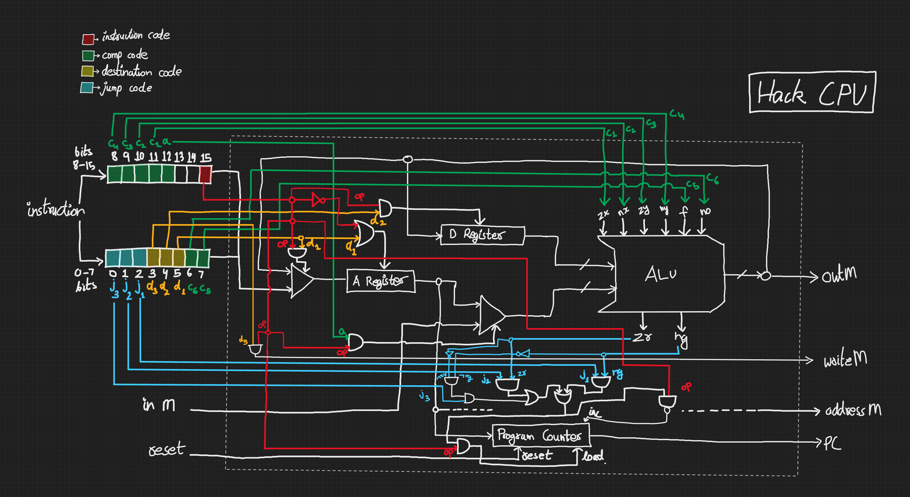
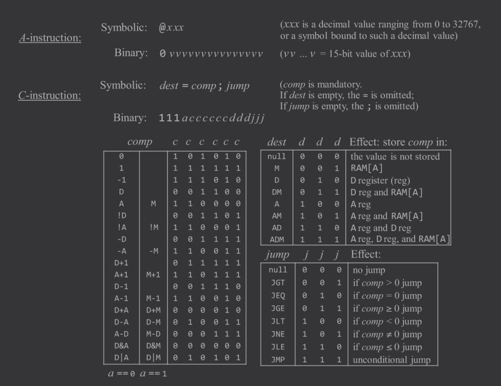
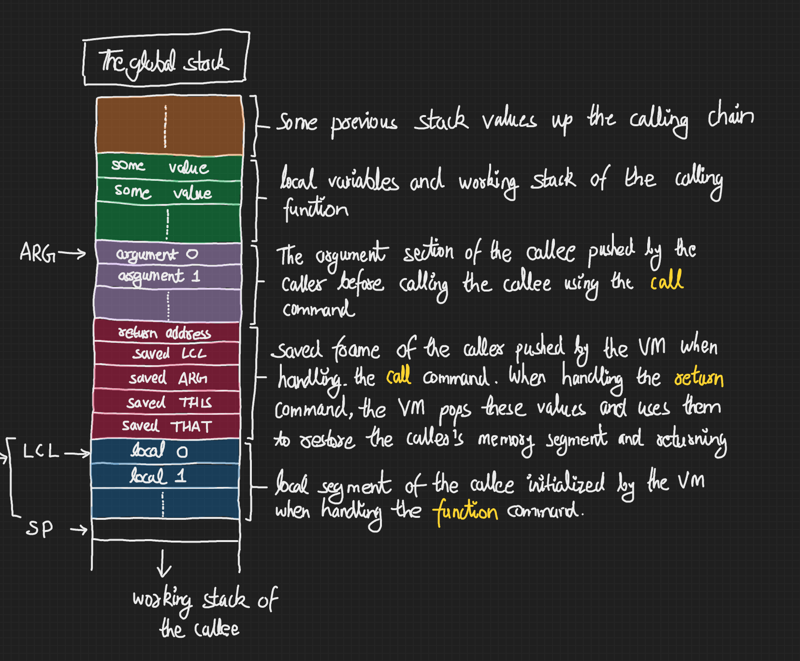
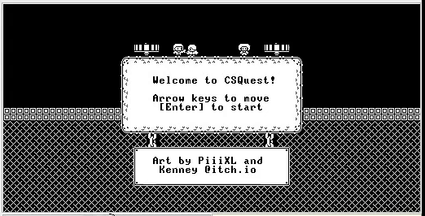
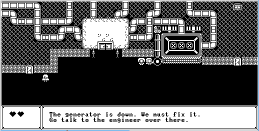
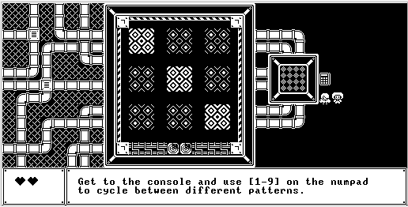
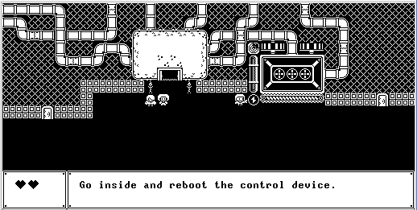
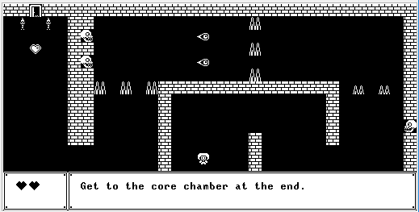
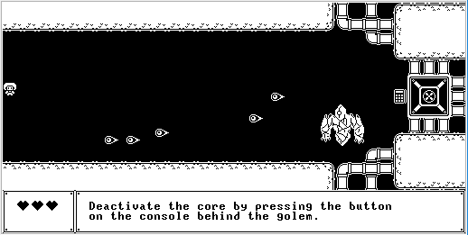
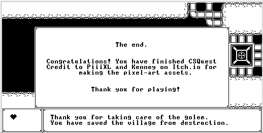

# nand2tetris

This repo contains the collection of all the non-trivial projects I made during the two-part [nand2tetris](https://www.coursera.org/learn/build-a-computer) course. As the description says, the course is about building a computer from scratch, all the way from logic gates to a proper program running on top of the hardware we've built.

Since this repo contains parts from the hardware interface layer (the assembler) and above, I will briefly describe the Hack Computer's specs before moving on to the individual projects.

## The Hack Computer

The Hack machine is a 16-bit von Neumann machine designed to execute programs written in the Hack machine language. It consists of,
- A CPU
- Two separate memory modules: one for *instruction memory* (instruction ROM) and one for *data memory* (the RAM)
- Two memory-mapped I/O devices: a *screen* and a *keyboard*.

The CPU consists of an ALU and three registers named *Data Register* (D), *Address Register* (A), and *Program Counter* (PC). The D register is used solely for storing and operating on data values while the A register is multi-purpose. It can either store a data value for computation, select an address in the *instruction memory*, or select an address in the *data memory*.

Below is my arrangement for the Hack CPU circuitry as it was implemented in HDL. There is probably a more efficient way to do this, but this is what I came up with and what worked in the simulator. The HDL file itself is included [here](./CPU.hdl) as well.



The point here is that *this is a really simple CPU*. None of the modern CPU magic (the pipelining, caches, memory controller, register files, functional units, etc.) is to be found here. So I hope this sets the proper precendence for what to expect out of the projects in this repo. On their own, they are quite simple, but when put together, they encompass an entire computer system from the ground up.

I'll briefly list what the each project is about while explaining how they fit into the Hack/Jack system. More detailed walkthroughs can be found in the individual project folders themselves. Let's start with the first one, the Hack Assembler

# Hack Assembler

The Hack Assembly language only consists of two kinds of instructions (i.e., there's only 1 bit for the op code): an ***A-instruction*** or a ***C-instruction***. Below are the instruction set mnemonics,



The A-instruction is the only way to input a constant into the computer. The instruction's primary purpose is to point to an address so as to either store the result of a C-instruction in the RAM or to jump to the address location in the instruction memory after executing a C-instruction. The C-instruction, on the other hand, is the most involved and performs all the computation the Hack CPU supports.

Together with these two, the Hack Assembly also supports adding labels in code to jump to, along with single-line comments starting with a "//". Furthermore, there are some special symbols/keywords which are reserved and point to locations in memory (mainly for pointing to memory segments for the VM). 

The assembler consumes a hack assembly program file and does the following:
- Cleans up all whitespace and comments
- Translates all symbols to the appropriate instruction addresses
- Convert all instructions and symbols to binary
- Output the resulting binary

The assembler performs this by doing two passes over the program code -- one to clean up and tally the symbols in a symbol table; the second one, to generate the required binaries.


# VM Translator

With the machinery and the interface (the assembler) done, we can now move on to building another layer of abstraction on top of this. Primarily because writing assembly is very time consuming and representing complex ideas in a high-level language is much easier.

The high-level language we're building toward is called ***Jack***. It is an object-oriented language with syntax similar to Java (more details to come with the compiler). And just like how Java goes through a two-stage compilation process -- where it is first compiled to an intermediate bytecode, which is then converted and run on the target machine by the Java Virtual Machine (the JVM) -- Jack is also first compiled to an intermediate VM code, which is then converted by the VM to Hack assembly.

This project covers the specifics of the Virtual Machine which'll sit on top of the assembly layer. Our program will translate VM code to Hack assembly.


## VM Commands

The VM in question is a stack-based VM which only supports a single data type: *a 16-bit integer*. It provides the following 4 types of commands:
- Basic commands: `push`, `pop`
- Arithmetic and logic commands: `add`, `sub`, `eq`, `gt`, `lt`, `and`, `or`, `not`, `neg`
- Branching commands: `label LABEL_NAME`, `if-goto LABEL_NAME`, `goto LABEL_NAME`
- Function commands: `function FUNCTION_NAME nVars`, `call FUNCTION_NAME nArgs`, `return`

The VM code follows the following syntax: `command segment index`

The `command` here refers to one of the 4 command types above. The `segment` part refers to one of the virtual memory segments that the VM provides, and the `index` part is an offset into that memory segment. In certain cases, the `segment` and `index` parts may be omitted.

The translation process involves juggling the data between the A-register, the D-register, and the stack to get to the required address, performing computations, and incrementing or decrementing the stack pointer appropriately.

## Function Calls

The VM provides the following three function-related primitives:
- `function FUNCTION_NAME nVars`
- `call FUNCTION_NAME nArgs`
- `return`

Each VM function starts with a `function` command, and ends with a `return` command.

During initialization (the first primitive), the VM inserts code to make space for all the local variables on the stack. The number of variables is denoted by the `nVars` value in the declaration. This value is actually calculated and placed there by the compiler.

Upon encountering a function call statement (the second primitive in the list), we save the caller's stack frame context onto the stack before making the function call. The `nArgs` value is inserted by the compiler after it pushes the required arguments on the stack. Upon return, we restore this context from the stack and continue execution. Here's a snapshot of the stack during a hypothetical execution,



The responsibility of our VM Translator is to generate the required assembly code so that this process of saving and restoring the function stack's frame is done automatically.

With this, one part of Jack's two-part compilation process is done. Now, let us move on to the Jack Compiler.

# Jack Compiler

Jack is a simple, Java-like, object-based programming language. It is designed to lend itself nicely to common compilation techniques. It is weakly typed and features only 3 primitive data types, but provides access to user-defined data types via objects. Here's an example Jack program for reference:

```JavaScript
/** Inputs a sequence of integers, and computes their average. */
class Main {
    function void main() {
        var Array a;        // Jack arrays are not typed
        var int length;
        var int i, sum;
        
        let i = 0;
        let sum = 0;
        let length = Keyboard.readInt("How many numbers? ");
        let a = Array.new(length);  // constructs the array
        
        while (i < length) {
            let a[i] = Keyboard.readInt("Enter a number: ");
            let sum = sum + a[i];
            let i = i + 1;
        }

        do Output.printString("The average is: ");
        do Output.printInt(sum / length);
        do Output.println();
        return;
    }
}
```
As you can see, we've got *classes*, *methods*, *functions*, *variables*, *arrays*, *expressions*, *comments*, *I/O*, and *strings* (I/O, arrays, and strings are actually provided by the [Jack Standard Library](./Jack-Standard-Library/)).

A Jack program is a collection of classes, each appearing in a separate file. The compilation unit is a class, which is a sequence of tokens structured according to a particular syntax. The syntax and grammar rules for Jack are defined in more detail in the project's own [readme](./JackCompiler/README.md).

## Compilation

Our Jack compiler is written in Java. It performs the compilation process in two phases:
1. Tokenize the given program text by, first, cleaning up all the whitespace and comments, and then generating a stream of parsed tokens.
2. Perform a recursive descent of the syntax tree and output the appropriate VM code as we go along.

### Tokenization

The given program file(s) is sent to `Tokenizer.java` which eliminates all the whitespace and comments, and returns an array of individual tokens extracted from the program. We define token types as one of the following inside `Tokens.java`:
- Keyword
- Symbol
- Identifier
- Integer constant
- String constant

The `Token.java` file, on the other hand, defines a `Token` datatype, which breaks down a token into a token type and a token value field. As the Tokenizer makes its way through the input file, it sends each token string to this Token class and stores the resulting Token object into a resizeable array (an ArrayDeque). Once the whole file is processed, the Tokenizer now holds the array of processed tokens and is ready to stream them to the CompilationEngine.

### Compilation Engine

While the output of the Tokenizer only gives us an array of Tokens, we still do not have a proper syntax tree yet. We can actually construct and parse the syntax tree at the same time in what is known as *recursive descent parsing*. 

Think of our stream of tokens as a queue. The `currentToken` variable always stores the current token in the queue. The `advance()` method advances the queue to the next token, updating the value of `currentToken`. The compilation engine effectively calls `advance()` and `compileCurrentToken()` repeatedly until there are no more tokens left in the queue.

`compileCurrentToken()` simply looks at the `currentToken` and calls the appropriate compilation subroutine. The subroutines, then, call each other recursively to process the current token. Calls to each of these dedicated subroutines directly follow the language grammar specification as guidelines. This way, our function calls map directly onto the syntax tree, effectively generating and parsing the tree at the same time.

### Code Generation

While parsing the syntax tree, the compiler also needs to do additional work to ensure that the program flow works according to the user's expectations. It needs to make sure branches are generated (for ifs and loops), identifiers are mapped to their appropriate memory locations, objects are mapped properly onto their memory blocks, constructors allocate enough memory, pushing function arguments onto the stack, handle array index syntax, and so on. All of this means the compiler needs to generate additional VM code. This requires the help of additional machinery, all of which is explained in the project's [readme](./JackCompiler/README.md).

Code generation calls from the compiler add the respective VM operation code into a buffer. Once the compiler is done with the program file, it instructs the VMWriter to write the contents of the buffer into the output file. The compiler will then move on to the next file in queue and start a new instance of the writer.

With that, our compilation process is complete.

# CSQuest

CSQuest is a small puzzle/adventure game written in Jack. The game can be run on the VM emulator provided [here](https://drive.google.com/file/d/1xZzcMIUETv3u3sdpM_oTJSTetpVee3KZ/view).

> *The artwork assets for the game are taken from the free assets put on itch.io by [PiiiXL](https://piiixl.itch.io/) and [Kenney](https://kenney.itch.io/), and then converted to bitmaps to work with the Hack CPU architecture.*



> [!NOTE]
> *While Nand2Tetris now uses their web-based IDE for emulation, since this project was written for the legacy Java software package linked above, it is recommended you run it there. The tick rate for the new web-based IDE's CPU is too fast which makes the game's tile animations and movement too jarring. Plus, there are numerous graphics bugs when running the game on it.*

Since our Hack CPU comes with a screen and a keyboard which are mapped onto the RAM (memory-mapped I/O), I decided to make a game that runs on this hardware. The screen is 512 pixels wide and 256 pixels tall, with each pixel mapped onto an idividual bit inside the RAM starting from location 0x4000 (16384). The screen polls the RAM and updates itself 60 times a second. All the graphics for the game are drawn by the game engine by writing the appropriate 16-bit words in memory.

The keyboard, on the other hand, is mapped on RAM location 0x6000 (24576). Any keyboard input updates this word in the RAM accordingly, which is then processed by the game engine to update the game's current state.

The game's design details and documentation can be found in the project's own [readme](./CSQuest/README.md).

## Gameplay

The player can use the arrow keys to move the main character around. When prompted, they can interact with certain game objects by pressing the `E` key.

The game has 5 levels, with 3 of them containing puzzles and 1 combat encounter. In the first level, the player starts off in a village where the generator siphoning power from the dungeon has been shut down due to flooding. The player is asked to assist the engineer in repairing it.



Talking to the engineer opens the gate to the second level. Here, they must assist the engineer by fixing the misaligned pipes to drain out the flood water and retrieve the power cores. Once the player returns the core to their respective slots, the water pumps start working and the player can access the next level.


The third level takes the player to the generator's main reactor room. Due to the flooding, the system modules have been scrambled. The player must make sure to restart the reactor by aligning all the modules (the patterns displayed in the center) with the one displayed on the console in three separate phases. Each pattern slot on the grid corresponds to a number on the keyboard's numpad. Pressing a key will cycle all the patterns in that row and column to the next cycle. The player must figure out the right combination of keys to press in order to turn all the patterns to the one displayed on the console to the right.



Once the player finishes all three puzzle phases, the reactor finally boots up and the player is taken back to the beginning of the game. This time, the generator is fully operational and running. The engineer now tells the player to go into the dungeon and disable the golem (who has now woken up due to a security measure in the dungeon). The player must head inside and reboot the control device to disable the golem so that power can be redirected to the village.



Before the player can get to the golem, they must make their way past the dungeon's security systems. If the player steps on the spikes or gets hit by a fireball, they lose one of their lives.



Once the player reaches the end of the corridor, they can enter the door and face their final opponent: the security golem. The player needs to dodge all the fireballs and interact with the console behind the boss to deactivate it.



Once the player does that, game is over.



At this point, the user can restart the emulator and play the game again if they want.